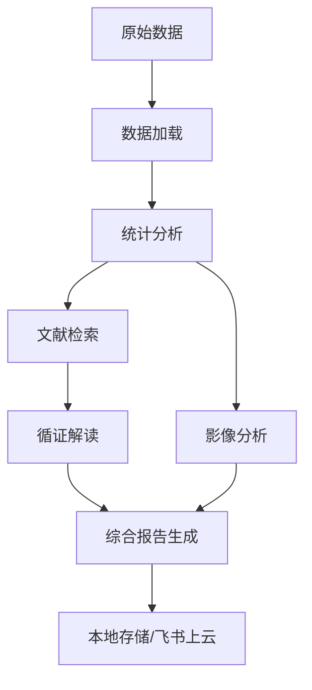

# Lab-Analysis

> **医学检验数据自动化分析流水线** - 多源融合临床决策支持系统

[](https://www.python.org/downloads/)
[](LICENSE)
[](https://github.com/nxz1026/Lab-Analysis)

---

## 📋 目录

- [功能概览](#-功能概览)
- [核心特性](#-核心特性)
- [系统架构](#-系统架构)
- [快速开始](#-快速开始)
- [详细使用指南](#-详细使用指南)
- [数据准备](#-数据准备)
- [配置说明](#️-配置说明)
- [输出文件说明](#-输出文件说明)
- [故障排查](#-故障排查)
- [开发指南](#-开发指南)
- [许可证](#-许可证)

---

## 🎯 功能概览

Lab-Analysis 是一个**端到端的医学数据分析流水线**，专为慢性胰腺炎等复杂病例设计。它能够自动整合：

✅ **检验报告数据** - 从结构化报告中提取26+项血液指标  
✅ **PubMed文献检索** - 基于异常指标的循证医学证据  
✅ **AI循证解读** - DeepSeek LLM生成的专业医学解读  
✅ **MRI影像分析** - Qwen-VL多模态模型印证诊断  
✅ **综合临床报告** - 三源融合的Markdown格式最终报告

### 处理流程



| 步骤 | 模块 | 输入 | 输出 |
|------|------|------|------|
| ① | `data_loader` | 结构化检验报告 | `lab_metrics.csv/json` |
| ② | `data_analyzer` | 检验指标时间序列 | 4张图表 + 统计结果 |
| ③ | `literature_searcher` | 异常指标列表 | PubMed文献（JSON/MD） |
| ④ | `literature_interpreter` | 检验数据 + 文献 | 循证医学解读 |
| ⑤ | `qwen_vl_report_check` | DICOM/MRI影像 | 影像印证报告 |
| ⑥ | `gen_final_report` | 所有中间结果 | 最终综合报告 |
| ⑦ | `upload_to_feishu` | 全部输出文件 | 飞书云盘归档 |

---

## ✨ 核心特性

### 🔬 多模态数据融合
- **检验数据**: 支持血常规、炎症标志物（CRP、hs-CRP）、红细胞参数等26+指标
- **影像学**: DICOM格式MRI/CT序列分析，支持多序列对比
- **文献证据**: PubMed实时检索，近5年高质量文献优先

### 🤖 AI驱动的智能分析
- **趋势检测**: 线性回归分析指标变化趋势（R²统计）
- **相关性矩阵**: Pearson相关系数计算，识别强相关指标对
- **炎症分期**: 自动判断急性期/过渡期/恢复期
- **异常检测**: 基于参考范围的自动标记

### 📊 专业可视化
- **趋势回归图**: 关键指标随时间的变化轨迹
- **相关性热图**: 指标间关联强度可视化
- **炎症状态图**: 各时间点的炎症程度分类
- **异常指标图**: 超出正常范围的指标高亮显示

### 📝 循证医学支持
- **智能检索策略**: 8个预定义检索主题（炎症、RDW预后、脓毒症等）
- **LLM深度解读**: 5维度分析（机制解释、临床意义、免疫学、建议、预后）
- **PMID引用**: 所有结论附带PubMed文献编号

### 🏥 临床实用性
- **三源质控**: 检验/影像/文献一致性评估
- **分级行动计划**: 🔴紧急 / 🟡重要 / 🟢常规
- **随访计划**: 短/中/长期监测方案
- **预后评估**: 基于多维度数据的综合判断

---

## 🏗️ 系统架构

### 项目结构

```
Lab-Analysis/
├── README.md                      # 本使用说明
├── LICENSE                        # MIT许可证
├── pyproject.toml                 # 包元数据与依赖管理
├── requirements.txt               # Python依赖列表
├── .gitignore                     # Git忽略规则
├── run_full_pipeline.py           # 完整Pipeline执行脚本（推荐）
├── run_analysis.py                # 快捷入口脚本
└── lab_analysis/                  # 核心Python包
    ├── __init__.py
    ├── __main__.py                # python -m lab_analysis 入口
    ├── pipeline.py                # 全流程编排器
    ├── patient_id.py              # 患者ID脱敏工具
    ├── data_loader.py             # 检验数据加载器
    ├── data_analyzer.py           # 统计分析引擎
    ├── literature_searcher.py     # PubMed文献检索
    ├── literature_interpreter.py  # LLM循证解读
    ├── qwen_vl_report_check.py    # MRI影像分析
    ├── gen_final_report.py        # 综合报告生成器
    ├── upload_to_feishu.py        # 飞书云盘上传
    └── ingest_image.py            # 影像入库辅助工具
```

### 数据流架构

```
原始数据层 (~/wiki/raw/patient_{ID}/)
├── papers/                        # 检验报告
│   ├── lab_report_YYYYMMDD_type/
│   │   ├── metadata.md            # 报告元数据
│   │   └── metrics.md             # 检验指标键值对
│   └── ...
└── imaging/                       # 医学影像
    ├── seq_01/                    # DICOM序列1
    │   ├── *.dcm                  # DICOM文件
    │   └── ...
    └── seq_02/                    # DICOM序列2

         ↓ Pipeline处理

输出数据层 (~/wiki/data/{ID}/{TIMESTAMP}/)
├── lab_metrics.csv/json           # 标准化检验数据
├── analysis_results.json          # 统计分析结果
├── fig_01~04_*.png                # 4张可视化图表
├── literature_results.json/md     # 文献检索结果
├── literature_interpretation.json/md  # 循证解读
├── mri_report_check_results.json/md   # 影像印证
└── final_integrated_report.md     # 最终综合报告

         ↓ 可选归档

本地归档 (~/wiki/local_upload/YYYY-MM-DD/)
├── 原始数据/
├── 文献参考/
├── 中间结果/
└── 统计结果/
```

---

## 🚀 快速开始

### 前置要求

#### 系统环境
- **操作系统**: Windows 10/11, Linux, macOS
- **Python**: ≥ 3.10 ([下载链接](https://www.python.org/downloads/))
- **内存**: 建议 ≥ 8GB（DICOM影像处理需要）
- **磁盘空间**: 至少 2GB（用于DICOM文件和输出）

#### API密钥（必需）

在用户主目录下创建 `~/.hermes/.env` 文件或设置环境变量：

```bash
# Windows PowerShell
$env:DEEPSEEK_API_KEY="sk-your-deepseek-key"
$env:DASHSCOPE_API_KEY="sk-your-dashscope-key"

# Linux/macOS
export DEEPSEEK_API_KEY=sk-your-deepseek-key
export DASHSCOPE_API_KEY=sk-your-dashscope-key
```

> **获取API密钥**:
> - DeepSeek: [https://platform.deepseek.com/](https://platform.deepseek.com/)
> - DashScope (Qwen-VL): [https://dashscope.aliyun.com/](https://dashscope.aliyun.com/)

#### 可选组件
- **飞书CLI**: 如需上传到飞书云盘，需安装 [`lark-cli`](https://open.feishu.cn/)

---

### 安装步骤

#### 1. 克隆仓库

```bash
git clone https://github.com/nxz1026/Lab-Analysis.git
cd Lab-Analysis
```

#### 2. 创建虚拟环境（推荐）

```bash
# Windows
python -m venv .venv
.venv\Scripts\activate

# Linux/macOS
python3 -m venv .venv
source .venv/bin/activate
```

#### 3. 安装依赖

```bash
# 升级pip
pip install --upgrade pip

# 可编辑安装（推荐，便于开发调试）
pip install -e .

# 或者仅安装依赖
pip install -r requirements.txt
```

#### 4. 验证安装

```bash
# 检查包是否正确安装
python -c "import lab_analysis; print('✅ 安装成功')"

# 查看帮助
python -m lab_analysis.pipeline --help
```

---

### 首次运行示例

#### 方式一：使用完整Pipeline脚本（推荐）

```bash
python run_full_pipeline.py
```

此脚本会自动：
1. ✅ 创建结构化检验报告数据
2. ✅ 解压DICOM影像文件
3. ✅ 运行完整Pipeline（不跳过任何步骤）
4. ✅ 显示输出文件列表

#### 方式二：直接调用Pipeline

```bash
# 使用原始患者ID（会自动脱敏）
python -m lab_analysis.pipeline --patient-id 513229198801040014

# 或使用已脱敏ID
python -m lab_analysis.pipeline --patient-id 846552421134373347
```

#### 方式三：使用快捷脚本

```bash
python run_analysis.py --patient-id 513229198801040014
```

> **提示**: 如果只想测试部分功能，可以添加参数：
> - `--skip-llm`: 跳过文献检索和循证解读
> - `--skip-imaging`: 跳过MRI影像分析

---

## 📁 数据准备

### 数据目录约定

本项目使用 `~/wiki` 作为工作区根目录：

```
~/wiki/
├── raw/                           # 原始数据目录
│   ├── Origin_data/               # 待处理的原始文件
│   │   ├── lab_*.jpg              # 检验报告图片
│   │   ├── mri_*.jpg              # MRI报告图片
│   │   └── export_*.zip           # DICOM压缩包
│   └── patient_{脱敏ID}/          # 按患者组织的结构化数据
│       ├── papers/                # 检验报告
│       │   └── lab_report_YYYYMMDD_type/
│       │       ├── metadata.md
│       │       └── metrics.md
│       └── imaging/               # 医学影像
│           └── seq_01/
│               └── *.dcm
└── data/                          # 输出数据目录
    └── {脱敏ID}/
        └── {TIMESTAMP}/           # 每次运行的时间戳子目录
            ├── *.csv/json         # 中间数据
            ├── *.png              # 图表
            └── *.md               # 报告
```

### 准备检验报告数据

#### 方法一：手动创建结构化文件（当前使用）

对于每个检验报告，在 `papers/lab_report_YYYYMMDD_type/` 目录下创建两个文件：

**metadata.md**（报告元数据）:
```markdown
| 字段 | 值 |
|------|-----|
| 患者ID | 513229198801040014 |
| 报告日期 | 2026-03-24 |
| 报告类型 | outpatient |
| 科室 | 消化内科 |
| 医生 | 李薇 |
| 诊断 | 慢性胰腺炎 |
```

**metrics.md**（检验指标，简单键值对格式）:
```text
WBC: 6.7
RBC: 4.52
HGB: 142
CRP: 10
hs-CRP: 2.78
NEUT%: 59.5
LYMPH%: 32.1
MONO%: 6.9
...
```

> **支持的指标**: WBC, RBC, HGB, HCT, PLT, PCT, MCV, MCH, MCHC, NEUT%, LYMPH%, MONO%, EO%, BASO%, NEUT#, LYMPH#, MONO#, EO#, BASO#, RDW-SD, RDW-CV, MPV, PDW, P-LCR, CRP, hs-CRP

#### 方法二：使用Vision识别（需要API密钥）

如果有OpenRouter API密钥，可以使用 `extract_lab_data.py` 自动识别检验报告图片：

```bash
python extract_lab_data.py --image-path C:\Users\ND\wiki\raw\Origin_data\lab_2026-03-24_outpatient.jpg
```

### 准备MRI影像数据

#### DICOM文件组织

1. **解压DICOM压缩包**:
```bash
# 假设ZIP文件在 Origin_data 目录
cd ~/wiki/raw/Origin_data
python -c "import zipfile; zipfile.ZipFile('export_part1.zip').extractall('dicom_temp')"
```

2. **复制到患者目录**:
```bash
# 将所有.dcm文件复制到 seq_01 目录
mkdir -p ~/wiki/raw/patient_{ID}/imaging/seq_01
cp dicom_temp/*/*.dcm ~/wiki/raw/patient_{ID}/imaging/seq_01/
```

3. **验证DICOM文件**:
```bash
ls ~/wiki/raw/patient_{ID}/imaging/seq_01/*.dcm | wc -l
# 应该显示DICOM文件数量（如858）
```

#### MRI报告图片

将MRI报告图片放在 `Origin_data/` 目录即可，Pipeline会自动处理。

---

## ⚙️ 配置说明

### 环境变量

| 变量名 | 说明 | 必需 | 示例 |
|--------|------|------|------|
| `DEEPSEEK_API_KEY` | DeepSeek API密钥 | ✅ | `sk-xxx` |
| `DASHSCOPE_API_KEY` | 阿里云DashScope密钥 | ✅ | `sk-xxx` |
| `ANALYSIS_TS` | 分析时间戳（自动生成） | ❌ | `20260507_003642` |
| `OPENROUTER_API_KEY` | OpenRouter密钥（可选） | ❌ | `sk-or-xxx` |

### 配置文件位置

- **API密钥**: `~/.hermes/.env` 或系统环境变量
- **患者映射**: `~/.hermes/patient_mapping.json`（可选）

**patient_mapping.json 示例**:
```json
{
  "513229198801040014": "846552421134373347"
}
```

### 修改默认参数

如需调整文献检索策略、LLM参数等，可直接编辑对应模块：

- **文献检索**: `lab_analysis/literature_searcher.py` 中的 `SEARCH_STRATEGIES`
- **LLM参数**: `lab_analysis/literature_interpreter.py` 中的 `max_tokens`, `temperature`
- **图表样式**: `lab_analysis/data_analyzer.py` 中的 matplotlib 配置

---

## 📖 详细使用指南

### 一键全流程（推荐新手）

使用 `run_full_pipeline.py` 脚本，它会自动完成所有准备工作：

```bash
cd Lab-Analysis
python run_full_pipeline.py
```

**执行流程**:
1. ✅ 创建4份结构化检验报告
2. ✅ 解压DICOM文件（858帧MRI序列）
3. ✅ 运行完整Pipeline（9个步骤，无跳过）
4. ✅ 显示所有输出文件

**预计耗时**: 5-10分钟（取决于网络速度和API响应）

---

### 标准Pipeline执行

#### 基本用法

```bash
# 使用原始患者ID（会自动脱敏）
python -m lab_analysis.pipeline --patient-id 513229198801040014

# 使用已脱敏ID
python -m lab_analysis.pipeline --patient-id 846552421134373347
```

#### 可选参数

```bash
# 跳过LLM相关步骤（文献检索+循证解读）
python -m lab_analysis.pipeline --patient-id <ID> --skip-llm

# 跳过影像分析
python -m lab_analysis.pipeline --patient-id <ID> --skip-imaging

# 同时跳过两者（快速测试）
python -m lab_analysis.pipeline --patient-id <ID> --skip-llm --skip-imaging
```

#### 输出示例

```
============================================================
[2026-05-07T00:36:42] Pipeline 启动
原始病人ID: 513229198801040014
脱敏病人ID: 846552421134373347
输出目录: data/846552421134373347/20260507_003642/
============================================================

[STEP] ③ 数据加载 (data_loader)
找到 4 份报告
  2026-03-24 | 慢性胰腺炎
  2026-03-30 | 慢性胰腺炎
  2026-04-08 | 发热待诊
  2026-04-14 | 发热待诊
CSV 已写入: lab_metrics.csv
JSON 已写入: lab_metrics.json

[STEP] ④ 数据分析 (data_analyzer)
数据范围: 2026-03-24 ~ 2026-04-14
共 4 份报告
炎症分类: {'03-24': '过渡期', '03-30': '过渡期', '04-08': '急性期', '04-14': '过渡期'}
异常指标: ['WBC', 'PCT', 'MONO%', 'NEUT#', 'LYMPH#', 'RDW-SD', 'RDW-CV', 'CRP', 'hs-CRP']
[CHARTS] 开始绘图...
  [OK] fig_01_trend_regression.png
  [OK] fig_02_correlation_heatmap.png
  [OK] fig_03_inflammation_status.png
  [OK] fig_04_abnormal_indicators.png

[STEP] ⑤ 文献检索 (literature_searcher)
  Searching [inflammation]: inflammation biomarker CRP review  [近5年]
  Searching [rdw_prognostic]: red cell distribution width inflammation biomarker review
  ...
[DONE] 检索完成: 39 篇唯一文献

[STEP] ⑥ 循证解读 (literature_interpreter)
构建 prompt...
调用 DeepSeek...
✅ 文献解读完成 → literature_interpretation.json
📄 Markdown 已保存: literature_interpretation.md

[STEP] ⑦ 影像分析 (qwen_vl_report_check)
📷 选取: seq_01/1.3.12.2.1107...dcm (肝胆胰脾T2加权横断面) 第270/858帧
  ✅ 完成
💾 结果已保存: mri_report_check_results.json
📄 Markdown 已保存: mri_report_check_results.md

[STEP] ⑧ 生成最终报告 (gen_final_report)
报告已保存: final_integrated_report.md

[STEP] ⑨ 飞书上云 (upload_to_feishu)
🎉 全部完成！
   ✅ 成功复制: 11 个文件
   📂 本地路径: C:\Users\ND\wiki\local_upload\2026-05-07

============================================================
✅ Pipeline 完成
============================================================
```

---

### 单步调试模式

如需单独运行某个模块进行调试，可在安装包后使用：

```bash
# 1. 数据加载
python -m lab_analysis.data_loader --patient-id 846552421134373347

# 2. 数据分析
python -m lab_analysis.data_analyzer --patient-id 846552421134373347

# 3. 文献检索（自定义主题）
python -m lab_analysis.literature_searcher \
  --patient-id 846552421134373347 \
  --topic "慢性胰腺炎 炎症标志物" \
  --n 20

# 4. 循证解读（指定输入文件）
python -m lab_analysis.literature_interpreter \
  --analysis data/analysis_results.json \
  --lit data/literature_results.json

# 5. 影像分析
python -m lab_analysis.qwen_vl_report_check --patient-id 846552421134373347

# 6. 生成最终报告
python -m lab_analysis.gen_final_report --patient-id 846552421134373347

# 7. 上传到飞书
python -m lab_analysis.upload_to_feishu --patient-id 846552421134373347
```

> **注意**: 单步运行时，相对路径仍相对于 `~/wiki/data/...`；全流程由 `pipeline` 注入环境变量 `ANALYSIS_TS` 区分多次运行的时间戳子目录。

---

### 批量处理多个患者

创建批处理脚本 `batch_run.sh`（Linux/macOS）或 `batch_run.bat`（Windows）：

**Linux/macOS**:
```bash
#!/bin/bash
PATIENT_IDS=("513229198801040014" "513229198801040015" "513229198801040016")

for PID in "${PATIENT_IDS[@]}"; do
    echo "Processing patient: $PID"
    python -m lab_analysis.pipeline --patient-id "$PID"
    echo "----------------------------------------"
done
```

**Windows PowerShell**:
```powershell
$PatientIDs = @("513229198801040014", "513229198801040015", "513229198801040016")

foreach ($PID in $PatientIDs) {
    Write-Host "Processing patient: $PID"
    python -m lab_analysis.pipeline --patient-id $PID
    Write-Host "----------------------------------------"
}
```

---

## 📄 输出文件说明

### 输出目录结构

每次Pipeline运行会在 `~/wiki/data/{脱敏ID}/{TIMESTAMP}/` 下生成以下文件：

#### 📊 数据文件

| 文件名 | 格式 | 大小 | 说明 |
|--------|------|------|------|
| `lab_metrics.csv` | CSV | ~1.5 KB | 标准化检验数据表格 |
| `lab_metrics.json` | JSON | ~6 KB | 检验数据JSON格式 |
| `analysis_results.json` | JSON | ~8 KB | 统计分析结果（趋势、相关性、异常） |

#### 📈 可视化图表

| 文件名 | 格式 | 大小 | 说明 |
|--------|------|------|------|
| `fig_01_trend_regression.png` | PNG | ~217 KB | 关键指标趋势回归图 |
| `fig_02_correlation_heatmap.png` | PNG | ~107 KB | 指标相关性热图 |
| `fig_03_inflammation_status.png` | PNG | ~34 KB | 炎症状态时序图 |
| `fig_04_abnormal_indicators.png` | PNG | ~77 KB | 异常指标汇总图 |

#### 📚 文献与解读

| 文件名 | 格式 | 大小 | 说明 |
|--------|------|------|------|
| `literature_results.json` | JSON | ~117 KB | PubMed文献元数据（39篇） |
| `literature_results.md` | Markdown | ~53 KB | 文献列表（含完整摘要） |
| `literature_interpretation.json` | JSON | ~10 KB | LLM解读JSON格式 |
| `literature_interpretation.md` | Markdown | ~9 KB | 循证医学解读报告 |

#### 🏥 影像分析

| 文件名 | 格式 | 大小 | 说明 |
|--------|------|------|------|
| `mri_report_check_results.json` | JSON | ~3.9 KB | MRI影像印证结果 |
| `mri_report_check_results.md` | Markdown | ~3.8 KB | 影像分析报告 |

#### 📝 最终报告

| 文件名 | 格式 | 大小 | 说明 |
|--------|------|------|------|
| `final_integrated_report.md` | Markdown | ~8.3 KB | **三源融合综合临床报告** |

---

### 最终报告内容结构

`final_integrated_report.md` 包含以下章节：

```markdown
# 最终综合临床诊断报告

## 一、患者基本信息与就诊背景
- 患者 demographics
- 检查编号
- 数据时间范围

## 二、检验数据与炎症状态综合分析
1. 炎症指标动态变化（CRP、WBC、NEUT#等）
2. 综合判断（急性期/过渡期/恢复期）

## 三、MRI影像学综合分析
- 数据来源
- 主要发现
- 临床关联

## 四、多学科联合诊断意见
1. 检验医学意见
2. 影像医学意见
3. 循证医学意见

## 五、核心诊断结论与鉴别诊断
- 核心诊断结论
- 诊断依据
- 鉴别诊断

## 六、结论一致性评估
- 三源质控结论
- 具体信号

## 七、行动计划
- 🔴 紧急事项
- 🟡 重要事项
- 🟢 常规事项

## 八、随访与监测计划
- 短期随访（1-2周）
- 中期随访（1-3个月）
- 长期随访（6-12个月）

## 九、预后评估
- 短期预后
- 长期预后
```

---

### 本地归档目录

Pipeline完成后，所有文件会自动归档到 `~/wiki/local_upload/YYYY-MM-DD/`：

```
2026-05-07/
├── 原始数据/              # lab_metrics.csv/json
├── 文献参考/              # literature_results.md
├── 中间结果/              # 图表、分析结果、影像报告
└── 统计结果/              # final_integrated_report.md
```

> **提示**: 此目录结构便于人工查阅和分享，可按日期备份。

---

## 🔧 故障排查

### 常见问题

#### 1. API密钥未配置

**错误信息**:
```
ValueError: 未找到 DEEPSEEK_API_KEY 环境变量
```

**解决方案**:
```bash
# Windows PowerShell
$env:DEEPSEEK_API_KEY="sk-your-key"

# Linux/macOS
export DEEPSEEK_API_KEY=sk-your-key

# 或写入 ~/.hermes/.env 文件
echo "DEEPSEEK_API_KEY=sk-your-key" >> ~/.hermes/.env
```

---

#### 2. 找不到患者数据目录

**错误信息**:
```
FileNotFoundError: No such file or directory: '~/wiki/raw/patient_XXX'
```

**解决方案**:
```bash
# 检查目录是否存在
ls ~/wiki/raw/patient_846552421134373347/papers/

# 如果不存在，创建结构化数据
python run_full_pipeline.py  # 会自动创建
```

---

#### 3. DICOM文件权限问题

**错误信息**:
```
PermissionError: [WinError 5] 拒绝访问
```

**解决方案**:
```bash
# Windows: 以管理员身份运行PowerShell
# 或使用robocopy复制文件
robocopy source_dir target_dir /E

# Linux/macOS: 检查文件权限
chmod -R 755 ~/wiki/raw/patient_*/imaging/
```

---

#### 4. 文献检索结果为空

**可能原因**:
- 网络连接问题
- PubMed API限流
- 检索关键词过于特殊

**解决方案**:
```bash
# 检查网络连接
curl https://eutils.ncbi.nlm.nih.gov/entrez/eutils/esearch.fcgi?db=pubmed&term=test

# 减少检索数量
python -m lab_analysis.literature_searcher --patient-id <ID> --n 5

# 手动测试检索
python -c "from lab_analysis.literature_searcher import search_pubmed; print(search_pubmed('inflammation', n=1))"
```

---

#### 5. 图表中文乱码

**现象**: 图表中的中文显示为方框或问号

**解决方案**:

**Windows**:
```python
# 在 data_analyzer.py 开头添加
import matplotlib
matplotlib.rcParams['font.sans-serif'] = ['SimHei']  # 黑体
matplotlib.rcParams['axes.unicode_minus'] = False
```

**Linux**:
```bash
# 安装中文字体
sudo apt-get install fonts-wqy-zenhei  # Debian/Ubuntu
sudo yum install wqy-zenhei-fonts      # CentOS/RHEL
```

**macOS**:
```python
matplotlib.rcParams['font.sans-serif'] = ['Arial Unicode MS']
```

---

#### 6. LLM输出被截断

**现象**: `literature_interpretation.md` 内容不完整

**原因**: `max_tokens` 参数设置过小

**解决方案**:
编辑 `lab_analysis/literature_interpreter.py`:
```python
payload = {
    "model": "deepseek-chat",
    "messages": [...],
    "temperature": 0.3,
    "max_tokens": 4096,  # 从1500增加到4096
}
```

---

#### 7. 内存不足（DICOM处理）

**错误信息**:
```
MemoryError: Unable to allocate array
```

**解决方案**:
```bash
# 关闭其他占用内存的程序
# 或增加虚拟内存（Windows）
# 或使用较小的DICOM子集进行测试
```

---

### 日志与调试

#### 查看详细日志

Pipeline运行时会在控制台输出详细日志，包括：
- 每个步骤的开始/结束时间
- 处理的文件路径
- API调用状态
- 错误堆栈信息

#### 启用调试模式

```bash
# 设置Python日志级别
export PYTHONDEBUG=1
python -m lab_analysis.pipeline --patient-id <ID>
```

#### 检查环境变量

```bash
# Windows
Get-ChildItem Env: | Where-Object { $_.Name -like '*KEY*' }

# Linux/macOS
env | grep KEY
```

---

### 性能优化建议

1. **并行处理**: 目前Pipeline是串行执行，未来可考虑并行化文献检索
2. **缓存机制**: 文献检索结果可缓存，避免重复请求
3. **DICOM预处理**: 大型DICOM序列可预先转换为NIfTI格式加速读取
4. **批量API调用**: LLM调用可增加重试机制和速率限制

---

## 💻 开发指南

### 贡献代码

欢迎提交Issue和Pull Request！

#### 开发环境设置

```bash
# 1. Fork仓库并克隆
git clone https://github.com/YOUR_USERNAME/Lab-Analysis.git
cd Lab-Analysis

# 2. 创建开发分支
git checkout -b feature/your-feature-name

# 3. 安装开发依赖
pip install -e .[dev]  # 如果pyproject.toml中有dev extras

# 4. 安装pre-commit hooks（可选）
pip install pre-commit
pre-commit install
```

#### 代码规范

- **Python版本**: ≥ 3.10
- **编码风格**: 遵循 [PEP 8](https://peps.python.org/pep-0008/)
- **类型提示**: 鼓励使用type hints
- **文档字符串**: 所有公共函数/类必须有docstring
- **提交信息**: 使用 [Conventional Commits](https://www.conventionalcommits.org/)

#### 运行测试

```bash
# 运行单元测试（如果有）
pytest tests/

# 运行集成测试
python -m lab_analysis.pipeline --patient-id TEST_ID --skip-llm --skip-imaging
```

---

### 模块开发指南

#### 添加新的分析模块

1. **创建模块文件**: `lab_analysis/your_module.py`
2. **实现main函数**:
```python
def main(patient_id: str, output_dir: Path):
    """模块主函数
    
    Args:
        patient_id: 脱敏患者ID
        output_dir: 输出目录
    """
    # 你的逻辑
    pass

if __name__ == "__main__":
    import argparse
    parser = argparse.ArgumentParser()
    parser.add_argument("--patient-id", required=True)
    args = parser.parse_args()
    main(args.patient_id, ...)
```
3. **注册到Pipeline**: 编辑 `lab_analysis/pipeline.py`，添加新步骤
4. **更新文档**: 在README中添加使用说明

#### 修改文献检索策略

编辑 `lab_analysis/literature_searcher.py`:

```python
SEARCH_STRATEGIES = [
    {
        "key": "your_topic",
        "query": "your search terms",
        "years": 5,
        "retmax": 6
    },
    # 添加新策略...
]
```

#### 自定义图表样式

编辑 `lab_analysis/data_analyzer.py` 中的绘图函数：

```python
plt.figure(figsize=(12, 8))
plt.plot(dates, values, marker='o', linestyle='-', color='#2196F3')
plt.title('Your Custom Title', fontsize=16, fontweight='bold')
plt.xlabel('Date', fontsize=12)
plt.ylabel('Value', fontsize=12)
plt.grid(True, alpha=0.3)
plt.tight_layout()
plt.savefig(output_path, dpi=300, bbox_inches='tight')
```

---

### 架构设计原则

1. **模块化**: 每个步骤独立可测试
2. **可扩展**: 易于添加新的数据源或分析模块
3. **容错性**: 单个步骤失败不影响其他步骤
4. **可追溯**: 所有输出带时间戳，便于复现
5. **隐私保护**: 患者ID自动脱敏，敏感数据不硬编码

---

### 版本历史

#### v1.0.0 (2026-05-07)
- ✅ 完整Pipeline实现（9个步骤）
- ✅ 检验数据加载与分析
- ✅ PubMed文献检索（8个主题）
- ✅ DeepSeek循证解读
- ✅ Qwen-VL MRI影像分析
- ✅ 三源融合综合报告
- ✅ 本地文件归档
- 🐛 修复文献摘要截断问题
- 🐛 修复LLM输出截断问题
- 🐛 修复检验指标解析问题（支持#字符）

---

## 📊 技术栈

| 类别 | 技术 |
|------|------|
| **语言** | Python 3.10+ |
| **数据处理** | pandas, numpy |
| **可视化** | matplotlib, seaborn |
| **医学影像** | pydicom |
| **文献检索** | requests (PubMed E-utilities) |
| **LLM** | DeepSeek API, Qwen-VL (DashScope) |
| **文件处理** | pathlib, json, csv |
| **打包** | setuptools, pip |

---

## 📝 许可证

本项目采用 [MIT License](LICENSE) 开源协议。

**简要说明**:
- ✅ 允许商业使用
- ✅ 允许修改和分发
- ✅ 允许私人使用
- ⚠️ 必须包含原作者版权声明和许可证副本
- ❌ 不提供担保

完整许可证文本请查看 [LICENSE](LICENSE) 文件。

---

## 🙏 致谢

- **PubMed**: 提供免费的生物医学文献检索服务
- **DeepSeek**: 提供强大的医学LLM能力
- **阿里云DashScope**: 提供Qwen-VL多模态模型
- **Matplotlib**: 优秀的Python可视化库
- **PyDICOM**: DICOM文件处理库

---

## 📧 联系方式

- **项目主页**: <https://github.com/nxz1026/Lab-Analysis>
- **问题反馈**: [GitHub Issues](https://github.com/nxz1026/Lab-Analysis/issues)
- **邮箱**: （如有需要可添加）

---

## ⭐ Star History

如果这个项目对您有帮助，欢迎给个Star！⭐

[](https://star-history.com/#nxz1026/Lab-Analysis&Date)

---

<div align="center">

**Made with ❤️ for Clinical Decision Support**

[⬆ 回到顶部](#lab-analysis)

</div>
